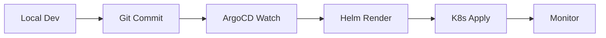

# ⚡ GitOps Quick Start

## 🎯 Швидкий Старт (10 Хвилин)

### Крок 1: Встановити ArgoCD

```bash
# Автоматичне встановлення
./scripts/argocd-setup.sh

# Після встановлення відкрити UI:
open https://localhost:8080

# Login: admin / <password from script output>
```

### Крок 2: Створити Helm Charts

```bash
# Автоматично створити структуру
./scripts/create-helm-structure.sh

# Перевірити charts
helm lint helm/charts/backend/
helm template test helm/charts/backend/
```

### Крок 3: Deploy до ArgoCD

```bash
# Додати Git repository
argocd repo add https://github.com/your-org/predator12.git

# Deploy backend до dev
kubectl apply -f argo/app-backend-dev.yaml

# Або deploy до всіх environments
kubectl apply -f argo/applicationset.yaml
```

### Крок 4: Моніторити

```bash
# Via CLI
argocd app list
argocd app get predator-backend-dev

# Via UI
open https://localhost:8080
```

---

## 📚 Повна Документація

Детальний опис GitOps workflow з ArgoCD + Helm: [GITOPS_ARGO_HELM.md](GITOPS_ARGO_HELM.md)

**Включає:**
- 🔧 Локальна розробка з VS Code
- 🚀 GitOps workflow
- 📦 Helm charts structure
- 🎨 Multi-environment promotion
- 📊 Observability stack
- 🔐 Secrets management
- 🔄 CI/CD integration

---

## 🛠️ Доступні Скрипти

| Скрипт | Призначення |
|--------|-------------|
| `argocd-setup.sh` | Встановити ArgoCD + CLI |
| `create-helm-structure.sh` | Створити Helm charts |
| `helm-deploy.sh` | Deploy через Helm (без ArgoCD) |

---

## 📁 Структура GitOps

```
predator12-local/
├── helm/                    # Helm charts
│   ├── charts/
│   │   ├── backend/        # FastAPI + Celery
│   │   ├── frontend/       # Next.js
│   │   └── dependencies/   # PG, Redis, Qdrant, OpenSearch
│   └── overlays/           # Environment-specific
│       ├── dev/
│       ├── staging/
│       └── prod/
├── argo/                    # ArgoCD manifests
│   ├── applicationset.yaml
│   └── app-backend-dev.yaml
└── scripts/                 # Automation
    ├── argocd-setup.sh
    └── create-helm-structure.sh
```

---

## 🔄 GitOps Workflow



1. **Розробка** - VS Code з debugging (F5)
2. **Commit** - Git push до feature branch
3. **Review** - Pull Request з CI checks
4. **Merge** - Auto-deploy до dev
5. **Promote** - Staging → Prod через tags

---

## 🎨 Environments

| Environment | Auto-Sync | Replicas | Resources |
|-------------|-----------|----------|-----------|
| **dev** | ✅ | 1 | Small |
| **staging** | ✅ | 2 | Medium |
| **prod** | ❌ Manual | 5+ | Large + HPA |

---

## 🔐 Secrets Management

### Варіант 1: External Secrets Operator + Vault
```bash
# Install External Secrets Operator
helm install external-secrets external-secrets/external-secrets -n external-secrets-system --create-namespace
```

### Варіант 2: Sealed Secrets
```bash
# Install Sealed Secrets
helm install sealed-secrets sealed-secrets/sealed-secrets -n kube-system
```

### Варіант 3: SOPS
```bash
# Encrypt secrets
sops -e helm/overlays/prod/secrets.yaml > helm/overlays/prod/secrets.enc.yaml
```

---

## 📊 Monitoring

### ArgoCD Metrics
```bash
# Port-forward Prometheus
kubectl port-forward -n argocd svc/argocd-metrics 8082:8082

# View metrics
open http://localhost:8082/metrics
```

### Application Metrics
```bash
# Backend metrics (FastAPI + Prometheus)
curl http://api.predator.local/metrics

# Key metrics:
# - predator_requests_total
# - predator_request_duration_seconds
# - predator_celery_tasks_total
```

---

## 🐛 Troubleshooting

### ArgoCD Не Синхронізується
```bash
# Check application status
argocd app get predator-backend-dev

# Manual sync
argocd app sync predator-backend-dev

# Check sync errors
kubectl logs -n argocd deployment/argocd-application-controller
```

### Helm Chart Помилки
```bash
# Lint chart
helm lint helm/charts/backend/

# Dry-run
helm template test helm/charts/backend/ --debug

# Validate manifests
helm template test helm/charts/backend/ | kubeval
```

### Application Не Стартує
```bash
# Check pods
kubectl get pods -n dev

# Check logs
kubectl logs -n dev deployment/predator-backend

# Check events
kubectl get events -n dev --sort-by='.lastTimestamp'
```

---

## 🔗 Корисні Команди

### ArgoCD
```bash
# List apps
argocd app list

# Get app details
argocd app get <app-name>

# Sync app
argocd app sync <app-name>

# Rollback
argocd app rollback <app-name> <revision>

# Delete app
argocd app delete <app-name>
```

### Helm
```bash
# List releases
helm list -A

# Get values
helm get values <release-name> -n <namespace>

# Upgrade release
helm upgrade <release-name> <chart> -f values.yaml -n <namespace>

# Rollback
helm rollback <release-name> <revision> -n <namespace>
```

### Kubernetes
```bash
# Get all resources
kubectl get all -n dev

# Describe pod
kubectl describe pod <pod-name> -n dev

# Port-forward
kubectl port-forward -n dev svc/backend 8000:8000

# Exec into pod
kubectl exec -it -n dev <pod-name> -- /bin/bash
```

---

## 🎓 Навчальні Ресурси

- 📖 [ArgoCD Documentation](https://argo-cd.readthedocs.io/)
- 📖 [Helm Documentation](https://helm.sh/docs/)
- 📖 [GitOps Principles](https://opengitops.dev/)
- 📖 [Kubernetes Best Practices](https://kubernetes.io/docs/concepts/configuration/overview/)
- 🎥 [ArgoCD Tutorial](https://www.youtube.com/watch?v=MeU5_k9ssrs)

---

## 🚀 Наступні Кроки

### Локально:
- [x] ✅ VS Code debugging налаштовано
- [x] ✅ Python 3.11 environment готовий
- [ ] 🔄 Створити Docker images для backend/frontend

### GitOps:
- [ ] 🔄 Встановити ArgoCD (`./scripts/argocd-setup.sh`)
- [ ] 🔄 Створити Helm charts (`./scripts/create-helm-structure.sh`)
- [ ] 🔄 Налаштувати Git repository
- [ ] 🔄 Deploy до dev environment
- [ ] 🔄 Налаштувати monitoring (Prometheus + Grafana)

### Production:
- [ ] 🔄 Налаштувати staging environment
- [ ] 🔄 Налаштувати prod environment з HPA
- [ ] 🔄 Налаштувати secrets management
- [ ] 🔄 Налаштувати CI/CD pipeline
- [ ] 🔄 Провести load testing

---

## 💡 Tips

> **Початківцям:** Почніть з dev environment та поступово переходьте до staging/prod.

> **Команді:** Використовуйте Pull Requests для всіх змін у Helm charts.

> **Production:** Завжди тестуйте зміни на staging перед prod deploy.

---

**Версія:** 1.0  
**Дата:** 6 січня 2025  
**Статус:** 📋 READY TO USE
