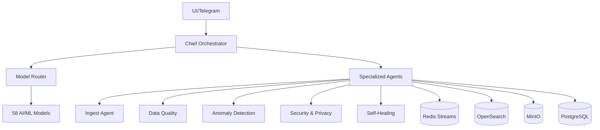

# 🤖 Predator11 Agents System

**Multi-Agent Enterprise System з 58 моделями, автосамолікуванням та комплаєнсом**

## 🎯 Огляд

Predator11 Agents — це повноцінна багатоагентна система для аналітики, що включає:

- **26 спеціалізованих агентів** з чіткими ролями та обов'язками
- **58 AI/ML моделей** з інтелектуальною маршрутизацією та фолбеками  
- **Автоматичне самолікування** та моніторинг системи
- **PII захист** та RBAC контроль доступу
- **Подієва архітектура** через Redis Streams
- **Повна спостережуваність** з метриками, логами та трейсами

## 🏗️ Архітектура



## 📋 Список агентів

### 🎯 Оркестрація та маршрутизація
- **ChiefOrchestratorAgent** (port 9001) - Головний діалоговий інтерфейс
- **ModelRouterAgent** (port 9002) - Маршрутизація на 58 моделей з фолбеками
- **ArbiterAgent** (port 9003) - Арбітраж відповідей кількох моделей

### 📊 Дані та ETL
- **IngestAgent** (port 9010) - Завантаження файлів з профілюванням та PII сканом
- **Schema&LineageAgent** (port 9011) - Схеми та лінійність даних
- **DataQualityAgent** (port 9012) - Правила якості та quality gates
- **EntityResolutionAgent** (port 9013) - Матчинг сутностей та дедуплікація
- **GeoEnrichmentAgent** (port 9014) - Геокодування та нормалізація
- **SyntheticDataAgent** (port 9015) - Автогенерація датасетів

### 🧠 Аналітика та ML
- **AnomalyAgent** (port 9020) - Детекція аномалій з поясненнями
- **ForecastAgent** (port 9021) - Прогнозування та what-if симуляції
- **GraphAgent** (port 9022) - Аналіз графів та мережева аналітика
- **PatternMiningAgent** (port 9023) - Пошук патернів та правил
- **RiskScoringAgent** (port 9024) - Інтегральний ризик-скоринг
- **ReportGenAgent** (port 9025) - Автогенерація звітів

### 🎯 LLM/UX сервіси
- **QueryPlannerAgent** (port 9030) - Природна мова → SQL/OpenSearch DSL
- **PromptEngineeringAgent** (port 9031) - Автопобудова та оптимізація промптів
- **DashboardBuilderAgent** (port 9032) - Автогенерація дашбордів

### 🛡️ Operational layer
- **SelfDiagnosisAgent** (port 9040) - Аналіз здоров'я системи та RCA
- **SelfHealingAgent** (port 9041) - Автоматичне відновлення та remediation
- **AutoTrainAgent** (port 9042) - Автотренування та канарейкові деплойменти
- **ReleaseManagerAgent** (port 9043) - Управління релізами та rollback

### 🔐 Безпека та комплаєнс
- **Security&PrivacyAgent** (port 9050) - PII маскування, RBAC, UEBA
- **ComplianceAgent** (port 9051) - GDPR та політики ретенції
- **Billing&QuotaAgent** (port 9052) - Облік використання та квоти
- **CostOptimizerAgent** (port 9053) - Оптимізація вартості

## 🚀 Швидкий старт

### Передумови
- Docker 20.10+
- Docker Compose 2.0+
- 8GB+ RAM
- 20GB+ вільного місця

### Запуск системи

```bash
# Клонування та перехід до директорії
cd Predator11/agents

# Запуск усіх агентів та інфраструктури
make up

# Перевірка здоров'я системи
make health

# Перегляд статусу контейнерів
make status
```

### Тестування

```bash
# Запуск базових тестів
make test

# Тестування окремих агентів
make test-chief
make test-router
make test-quality
make test-anomaly
```

## 🔧 API Endpoints

### Chief Orchestrator (порт 9001)
```bash
# Відправлення запиту користувача
curl -X POST http://localhost:9001/chief/ask \
  -H "Content-Type: application/json" \
  -d '{
    "query": "Знайди аномалії по HS 8544 за серпень",
    "channel": "api",
    "user_id": "analyst_001"
  }'

# Перевірка статусу задачі
curl http://localhost:9001/chief/status/{task_id}
```

### Model Router (порт 9002)
```bash
# Маршрутизація запиту на модель
curl -X POST http://localhost:9002/router/route \
  -H "Content-Type: application/json" \
  -d '{
    "model_type": "reasoning",
    "prompt": "Проаналізуй цей митний запис на предмет ризиків",
    "max_tokens": 1000
  }'

# Список доступних моделей
curl http://localhost:9002/router/models

# Статистика використання
curl http://localhost:9002/router/usage
```

### Data Quality Agent (порт 9012)
```bash
# Запуск перевірки якості
curl -X POST http://localhost:9012/quality/run \
  -H "Content-Type: application/json" \
  -d '{
    "dataset_id": "customs_data_2024",
    "rules": []
  }'

# Отримання звіту якості
curl http://localhost:9012/quality/report/{dataset_id}
```

### Anomaly Agent (порт 9020)
```bash
# Детекція аномалій
curl -X POST http://localhost:9020/anomaly/run \
  -H "Content-Type: application/json" \
  -d '{
    "index": "customs_safe_current",
    "field": "amount",
    "method": "isolation_forest",
    "window": "7d"
  }'
```

## 📊 Моніторинг та спостережуваність

### Доступні дашборди
- **Grafana**: http://localhost:3000 (admin/admin)
- **Prometheus**: http://localhost:9090
- **Traefik**: http://localhost:8080
- **MinIO**: http://localhost:9001 (minioadmin/minioadmin)

### Логи та метрики
```bash
# Перегляд логів усіх агентів
make logs

# Логи конкретного агента
make logs-agent AGENT=chief

# Відкриття Redis CLI
make redis-cli

# Health check усіх сервісів
make health
```

## 🛠️ Розробка та налаштування

### Структура проекту
```
agents/
├── docker-compose.agents.yml    # Основний compose файл
├── Makefile                     # Команди управління
├── agents.yaml                  # Реєстр усіх агентів
├── chief/                       # Chief Orchestrator Agent
├── model-router/               # Model Router Agent
├── ingest/                     # Ingest Agent
├── data-quality/              # Data Quality Agent
├── anomaly/                   # Anomaly Agent
├── security-privacy/          # Security & Privacy Agent
├── self-healing/             # Self-Healing Agent
└── ...
```

### Додавання нового агента

1. Створіть директорію `agents/new-agent/`
2. Додайте `new_agent.py`, `Dockerfile`, `requirements.txt`
3. Зареєструйте в `agents.yaml`
4. Додайте сервіс в `docker-compose.agents.yml`
5. Оновіть Makefile з новими командами

### Налаштування моделей

Конфігурація 58 моделей знаходиться в `model-router/model_router.py`:

```python
# Додавання нової моделі
models["new-provider/new-model"] = ModelConfig(
    name="new-provider/new-model",
    provider="new-provider", 
    model_type=ModelType.REASONING,
    max_tokens=32768,
    cost_per_1k=0.02,
    rate_limit_rpm=200,
    timeout=30,
    priority=5
)
```

## 🔐 Безпека та доступ

### RBAC ролі
- **admin**: Повний доступ до всіх ресурсів
- **sec_officer**: Безпека, комплаєнс, аудит
- **analyst**: Аналітика без PII доступу  
- **viewer**: Тільки перегляд дашбордів

### PII захист
Усі персональні дані автоматично маскуються згідно з ролями:
```bash
# Маскування PII в даних
curl -X POST http://localhost:9050/security/mask \
  -H "Authorization: Bearer {jwt_token}" \
  -H "Content-Type: application/json" \
  -d '{
    "data": {
      "name": "Іван Петренко", 
      "email": "ivan@example.com"
    },
    "resource": "customer_data"
  }'
```

## 📈 Масштабування

### Горизонтальне масштабування
```bash
# Масштабування агента до 3 реплік
make scale AGENT=chief REPLICAS=3

# Масштабування через Docker Compose
docker-compose -f docker-compose.agents.yml up -d --scale anomaly-agent=5
```

### Оптимізація ресурсів
- Використовуйте `CostOptimizerAgent` для автоматичної оптимізації
- Налаштуйте кешування в Redis для частих запитів
- Використовуйте дешевші моделі для простих задач

## 🧪 Тестування

### Unit тести
```bash
# Запуск unit тестів для агента
cd agents/chief
python -m pytest tests/

# Тестування з покриттям
python -m pytest --cov=chief_orchestrator tests/
```

### Integration тести
```bash
# E2E тестування через API
make test

# Chaos testing (зупинка агентів)
docker stop predator11-anomaly
make health  # Перевірка самолікування
```

## 🔧 Troubleshooting

### Часті проблеми

**Агент не відповідає**
```bash
# Перевірка логів
make logs-agent AGENT=chief

# Перезапуск агента
make restart-chief

# Health check
curl http://localhost:9001/chief/health
```

**Проблеми з моделями**
```bash
# Статистика Model Router
curl http://localhost:9002/router/usage

# Перевірка фолбеків
curl http://localhost:9002/router/models
```

**Проблеми з даними**
```bash
# Перевірка OpenSearch
curl http://localhost:9200/_cluster/health

# Перевірка MinIO
curl http://localhost:9000/minio/health/live

# Redis статус
make redis-cli
> ping
```

### Повне відновлення
```bash
# Повний рестарт
make restart

# Очищення даних (УВАГА: втрата даних!)
make clean

# Повне перевстановлення
make reset
```

## 📚 Додаткова документація

- [Agents Registry](agents.yaml) - Повний реєстр агентів з конфігурацією
- [Model Configuration](model-router/model_router.py) - Конфігурація 58 моделей
- [Security Policies](security-privacy/security_agent.py) - Політики безпеки та PII
- [API Documentation](http://localhost:9001/docs) - Swagger документація

## 🆘 Підтримка

При виникненні проблем:

1. Перевірте health check: `make health`
2. Перегляньте логи: `make logs`
3. Перевірте статус контейнерів: `make status`
4. Спробуйте перезапуск: `make restart`

---

**Predator11 Agents System** - Ваш надійний партнер в enterprise аналітиці! 🚀
