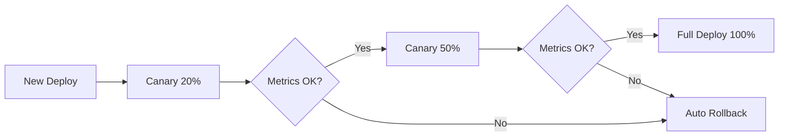

# AI DevOps Guide for Predator12

## 🎯 Overview

This guide covers AI-driven DevOps practices for Predator12, including self-healing, autoscaling, CI/CD guards, and query optimization.

---

## 🤖 AI Agents Architecture

### Agent Categories

Predator12 uses 26+ specialized AI agents organized into categories:

```
predator12/agents/
├── supervisor/          # Orchestration & coordination
├── etl/                # Data extraction & transformation
│   ├── csv_agent.py
│   ├── pdf_agent.py
│   ├── excel_agent.py
│   └── web_scraper.py
├── rag/                # Retrieval-Augmented Generation
│   ├── query_agent.py
│   ├── indexer_agent.py
│   └── reranker_agent.py
├── communication/      # External integrations
│   ├── telegram_bot.py
│   ├── slack_bot.py
│   └── email_agent.py
├── ml/                 # Machine learning tasks
│   ├── embeddings.py
│   ├── classification.py
│   └── prediction.py
├── ops/                # Operations & monitoring
│   ├── health_checker.py
│   ├── log_analyzer.py
│   └── alert_manager.py
└── optimization/       # Performance optimization
    ├── query_optimizer.py
    ├── code_reviewer.py
    └── resource_optimizer.py
```

### Agent Registry

Each agent registers itself in the Agent Web UI:

```python
# agents/base_agent.py
from typing import Dict, Optional
import asyncio
from datetime import datetime

class BaseAgent:
    def __init__(self, name: str, category: str):
        self.name = name
        self.category = category
        self.status = "starting"
        self.metrics = {}
        self.last_seen = None
    
    async def register(self):
        """Register with agent management system."""
        async with aiohttp.ClientSession() as session:
            await session.post(
                "http://agent-ui:8080/api/agents/register",
                json={
                    "name": self.name,
                    "category": self.category,
                    "status": self.status
                }
            )
    
    async def heartbeat(self):
        """Send periodic heartbeat."""
        while True:
            self.last_seen = datetime.now().isoformat()
            async with aiohttp.ClientSession() as session:
                await session.post(
                    f"http://agent-ui:8080/api/agents/{self.name}/heartbeat",
                    json={
                        "status": self.status,
                        "metrics": self.metrics
                    }
                )
            await asyncio.sleep(30)
    
    async def run(self):
        """Override in subclass."""
        raise NotImplementedError
```

---

## 📊 Agent Monitoring

### Web UI Features

The Agent Web UI provides:

1. **Real-time Status Dashboard**
   - Visual grid of all agents
   - Status indicators (running/stopped/error)
   - Key metrics per agent
   - Last seen timestamp

2. **Agent Controls**
   - Restart individual agents
   - View logs
   - Update configuration
   - Enable/disable agents

3. **Metrics Visualization**
   - Tasks processed
   - Error rates
   - Processing times
   - Resource usage

4. **WebSocket Updates**
   - Live updates without refresh
   - Instant status changes
   - Real-time metrics

### Accessing the UI

```bash
# Port-forward to local machine
kubectl port-forward svc/agent-ui 8080:8080

# Open in browser
open http://localhost:8080
```

---

## 🔄 Self-Healing Implementation

### Components

1. **Argo Rollouts**: Progressive delivery with canary analysis
2. **Prometheus**: Metrics collection and alerting
3. **PrometheusRules**: Define alert conditions
4. **AnalysisTemplates**: Automated quality gates

### Deployment Workflow



### Custom Health Checks

```python
# agents/ops/health_checker.py
import asyncio
from typing import Dict, List
import aiohttp

class HealthChecker:
    async def check_backend(self) -> Dict:
        """Check backend health."""
        try:
            async with aiohttp.ClientSession() as session:
                async with session.get("http://backend:8000/health", timeout=5) as resp:
                    if resp.status == 200:
                        return {"status": "healthy", "latency_ms": resp.elapsed.total_seconds() * 1000}
                    return {"status": "unhealthy", "code": resp.status}
        except Exception as e:
            return {"status": "error", "error": str(e)}
    
    async def check_database(self) -> Dict:
        """Check database connectivity."""
        import asyncpg
        try:
            conn = await asyncpg.connect("postgresql://...")
            result = await conn.fetchval("SELECT 1")
            await conn.close()
            return {"status": "healthy", "response": result}
        except Exception as e:
            return {"status": "error", "error": str(e)}
    
    async def check_all(self) -> Dict[str, Dict]:
        """Check all services."""
        results = await asyncio.gather(
            self.check_backend(),
            self.check_database(),
            self.check_redis(),
            self.check_qdrant(),
            return_exceptions=True
        )
        
        return {
            "backend": results[0],
            "database": results[1],
            "redis": results[2],
            "qdrant": results[3],
            "overall": "healthy" if all(r.get("status") == "healthy" for r in results if isinstance(r, dict)) else "degraded"
        }
```

---

## 📈 AI-Powered Autoscaling

### Multi-Metric Autoscaling

Predator12 uses multiple signals for scaling decisions:

1. **CPU/Memory** (standard HPA)
2. **Celery Queue Length** (custom metric)
3. **Request Rate** (custom metric)
4. **Predicted Load** (ML-based)

### ML-Based Load Prediction

```python
# scripts/autoscale_agent.py (advanced version)
import numpy as np
from sklearn.linear_model import LinearRegression
from sklearn.preprocessing import StandardScaler
import joblib

class MLAutoscaler:
    def __init__(self):
        self.model = LinearRegression()
        self.scaler = StandardScaler()
        self.history = []
    
    def collect_features(self, timestamp: datetime) -> np.ndarray:
        """Extract time-based features."""
        return np.array([
            timestamp.hour,                    # Hour of day
            timestamp.weekday(),               # Day of week
            timestamp.day,                     # Day of month
            int(timestamp.weekday() >= 5),     # Is weekend
            int(9 <= timestamp.hour <= 17),    # Business hours
        ])
    
    def train(self, historical_data: List[Dict]):
        """Train prediction model."""
        X = []
        y = []
        
        for point in historical_data:
            features = self.collect_features(point['timestamp'])
            X.append(features)
            y.append(point['load'])
        
        X = np.array(X)
        y = np.array(y)
        
        X_scaled = self.scaler.fit_transform(X)
        self.model.fit(X_scaled, y)
        
        # Save model
        joblib.dump(self.model, 'models/autoscale_model.pkl')
        joblib.dump(self.scaler, 'models/autoscale_scaler.pkl')
    
    def predict(self, timestamp: datetime) -> float:
        """Predict load for given timestamp."""
        features = self.collect_features(timestamp)
        features_scaled = self.scaler.transform([features])
        predicted_load = self.model.predict(features_scaled)[0]
        
        # Add safety margin
        return predicted_load * 1.15
    
    def get_recommended_replicas(
        self,
        current_load: float,
        predicted_load: float,
        current_replicas: int
    ) -> int:
        """Calculate recommended replica count."""
        # Target: 70% CPU utilization per replica
        target_utilization = 0.7
        
        # Calculate required replicas
        required = predicted_load / (target_utilization * current_load / current_replicas)
        
        # Round up and clamp to limits
        return max(1, min(10, int(np.ceil(required))))
```

---

## 🛡️ AI-CI/CD Guard

### Code Quality Checks

```python
# scripts/ci/ai_code_reviewer.py
import ast
import sys
from typing import List, Dict

class AICodeReviewer:
    def analyze_file(self, filepath: str) -> List[Dict]:
        """Analyze Python file for issues."""
        with open(filepath) as f:
            code = f.read()
        
        issues = []
        
        try:
            tree = ast.parse(code)
            
            # Check for common issues
            for node in ast.walk(tree):
                # Too many arguments
                if isinstance(node, ast.FunctionDef):
                    if len(node.args.args) > 7:
                        issues.append({
                            'type': 'complexity',
                            'line': node.lineno,
                            'message': f'Function {node.name} has too many arguments ({len(node.args.args)})'
                        })
                
                # Nested loops (potential O(n²))
                if isinstance(node, ast.For):
                    for child in ast.walk(node):
                        if isinstance(child, ast.For) and child != node:
                            issues.append({
                                'type': 'performance',
                                'line': node.lineno,
                                'message': 'Nested loops detected - consider optimization'
                            })
                
                # Bare except
                if isinstance(node, ast.ExceptHandler):
                    if node.type is None:
                        issues.append({
                            'type': 'antipattern',
                            'line': node.lineno,
                            'message': 'Bare except clause - specify exception types'
                        })
        
        except SyntaxError as e:
            issues.append({
                'type': 'syntax',
                'line': e.lineno,
                'message': f'Syntax error: {e.msg}'
            })
        
        return issues
    
    def create_pr_comment(self, issues: List[Dict]) -> str:
        """Create GitHub PR comment."""
        if not issues:
            return "✅ **AI Code Review**: No issues found!"
        
        comment = ["## 🤖 AI Code Review\n"]
        
        grouped = {}
        for issue in issues:
            itype = issue['type']
            if itype not in grouped:
                grouped[itype] = []
            grouped[itype].append(issue)
        
        for itype, items in grouped.items():
            icon = {
                'complexity': '🔴',
                'performance': '🟡',
                'antipattern': '🟠',
                'syntax': '❌'
            }.get(itype, '•')
            
            comment.append(f"\n### {icon} {itype.upper()} ({len(items)} found)\n")
            for item in items:
                comment.append(f"- Line {item['line']}: {item['message']}\n")
        
        return "".join(comment)
```

---

## 🔍 Query Optimization Agent

### Advanced Query Analysis

```python
# scripts/db/query_optimizer_agent.py (production version)
import asyncpg
from typing import List, Dict
import re

class AdvancedQueryOptimizer:
    async def analyze_execution_plan(self, query: str) -> Dict:
        """Deep analysis of execution plan."""
        conn = await asyncpg.connect("postgresql://...")
        
        # Get execution plan with all details
        plan = await conn.fetch(f"""
            EXPLAIN (
                ANALYZE true,
                BUFFERS true,
                VERBOSE true,
                COSTS true,
                FORMAT JSON
            ) {query}
        """)
        
        plan_json = plan[0]['QUERY PLAN'][0]
        
        await conn.close()
        
        return {
            'execution_time': plan_json['Execution Time'],
            'planning_time': plan_json['Planning Time'],
            'total_cost': plan_json['Plan']['Total Cost'],
            'plan_details': self.extract_bottlenecks(plan_json)
        }
    
    def extract_bottlenecks(self, plan: Dict) -> List[Dict]:
        """Extract performance bottlenecks."""
        bottlenecks = []
        
        def traverse(node, depth=0):
            node_type = node.get('Node Type', '')
            
            # Sequential scans on large tables
            if node_type == 'Seq Scan':
                rows = node.get('Plan Rows', 0)
                if rows > 1000:
                    bottlenecks.append({
                        'type': 'seq_scan',
                        'severity': 'high',
                        'table': node.get('Relation Name'),
                        'rows': rows,
                        'suggestion': f"Consider adding index on {node.get('Filter', 'WHERE clause')}"
                    })
            
            # Nested loops on large datasets
            if node_type == 'Nested Loop':
                outer_rows = node.get('Plans', [{}])[0].get('Actual Rows', 0)
                if outer_rows > 100:
                    bottlenecks.append({
                        'type': 'nested_loop',
                        'severity': 'medium',
                        'rows': outer_rows,
                        'suggestion': 'Consider using hash join instead'
                    })
            
            # Recursive traversal
            for child in node.get('Plans', []):
                traverse(child, depth + 1)
        
        traverse(plan['Plan'])
        return bottlenecks
    
    def generate_index_suggestions(self, bottlenecks: List[Dict]) -> List[str]:
        """Generate specific index creation commands."""
        suggestions = []
        
        for bottleneck in bottlenecks:
            if bottleneck['type'] == 'seq_scan':
                table = bottleneck['table']
                # Parse filter condition to extract columns
                # (simplified - use real query parser in production)
                suggestions.append(
                    f"-- For table {table}\n"
                    f"CREATE INDEX CONCURRENTLY idx_{table}_optimized "
                    f"ON {table} USING btree (/* columns from WHERE clause */);\n"
                )
        
        return suggestions
```

---

## 📊 Observability Stack

### OpenTelemetry Integration

```python
# backend/app/telemetry.py
from opentelemetry import trace, metrics
from opentelemetry.exporter.otlp.proto.grpc.trace_exporter import OTLPSpanExporter
from opentelemetry.exporter.otlp.proto.grpc.metric_exporter import OTLPMetricExporter
from opentelemetry.sdk.trace import TracerProvider
from opentelemetry.sdk.trace.export import BatchSpanProcessor
from opentelemetry.sdk.metrics import MeterProvider
from opentelemetry.sdk.metrics.export import PeriodicExportingMetricReader
from opentelemetry.instrumentation.fastapi import FastAPIInstrumentor
from opentelemetry.instrumentation.sqlalchemy import SQLAlchemyInstrumentor
from opentelemetry.instrumentation.redis import RedisInstrumentor

def setup_telemetry(app):
    """Setup OpenTelemetry for FastAPI app."""
    
    # Tracing
    trace_provider = TracerProvider()
    trace_exporter = OTLPSpanExporter(endpoint="http://otel-collector:4317")
    trace_provider.add_span_processor(BatchSpanProcessor(trace_exporter))
    trace.set_tracer_provider(trace_provider)
    
    # Metrics
    metric_reader = PeriodicExportingMetricReader(
        OTLPMetricExporter(endpoint="http://otel-collector:4317")
    )
    meter_provider = MeterProvider(metric_readers=[metric_reader])
    metrics.set_meter_provider(meter_provider)
    
    # Auto-instrumentation
    FastAPIInstrumentor.instrument_app(app)
    SQLAlchemyInstrumentor().instrument()
    RedisInstrumentor().instrument()
    
    return trace.get_tracer(__name__), metrics.get_meter(__name__)
```

---

## 🎯 Acceptance Testing

### E2E Rollout Failure Test

```python
# scripts/tests/e2e_rollout_failure.py
import asyncio
import aiohttp
from datetime import datetime

async def simulate_failure():
    """Simulate backend failure to test self-healing."""
    
    print("🧪 Starting E2E rollout failure test...")
    
    # Step 1: Trigger deployment with intentional error
    print("1️⃣ Triggering deployment...")
    async with aiohttp.ClientSession() as session:
        await session.post(
            "http://backend:8000/api/admin/trigger-errors",
            json={"error_rate": 0.10}  # 10% error rate
        )
    
    # Step 2: Wait for Argo Rollouts to detect
    print("2️⃣ Waiting for Argo Rollouts detection...")
    await asyncio.sleep(120)  # 2 minutes
    
    # Step 3: Verify rollback occurred
    print("3️⃣ Verifying automatic rollback...")
    rollout_status = await check_rollout_status()
    
    if rollout_status["phase"] == "Degraded":
        print("✅ Test PASSED: Rollback detected!")
        return True
    else:
        print(f"❌ Test FAILED: Expected Degraded, got {rollout_status['phase']}")
        return False

async def check_rollout_status():
    """Check Argo Rollouts status."""
    # Use kubectl or Argo API
    import subprocess
    result = subprocess.run(
        ["kubectl", "argo", "rollouts", "status", "predator-backend", "-o", "json"],
        capture_output=True,
        text=True
    )
    import json
    return json.loads(result.stdout)

if __name__ == "__main__":
    success = asyncio.run(simulate_failure())
    exit(0 if success else 1)
```

---

## 🔐 Security Best Practices

### RBAC for AI Agents

```yaml
# agents-rbac.yaml
apiVersion: v1
kind: ServiceAccount
metadata:
  name: ai-agent-sa
  namespace: default
---
apiVersion: rbac.authorization.k8s.io/v1
kind: Role
metadata:
  name: ai-agent-role
  namespace: default
rules:
  # Read-only access to pods/logs
  - apiGroups: [""]
    resources: ["pods", "pods/log"]
    verbs: ["get", "list", "watch"]
  
  # Read metrics
  - apiGroups: ["metrics.k8s.io"]
    resources: ["pods"]
    verbs: ["get", "list"]
  
  # NO access to secrets
  - apiGroups: [""]
    resources: ["secrets"]
    verbs: []
---
apiVersion: rbac.authorization.k8s.io/v1
kind:RoleBinding
metadata:
  name: ai-agent-binding
  namespace: default
subjects:
  - kind: ServiceAccount
    name: ai-agent-sa
roleRef:
  kind: Role
  name: ai-agent-role
  apiGroup: rbac.authorization.k8s.io
```

---

## 📚 Additional Resources

- [Self-Healing Stack](./SELF_IMPROVING_STACK.md)
- [GitOps with ArgoCD](./GITOPS_ARGO_HELM.md)
- [Runbook: Self-Healing](./RUNBOOK_self_healing.md)
- [Agent Web UI](http://agent-ui:8080)
- [Grafana Dashboards](http://grafana:3000)
- [Prometheus Alerts](http://prometheus:9090/alerts)

---

**Last Updated:** 2025-01-06  
**Version:** 1.0  
**Maintainer:** AI/DevOps Team
