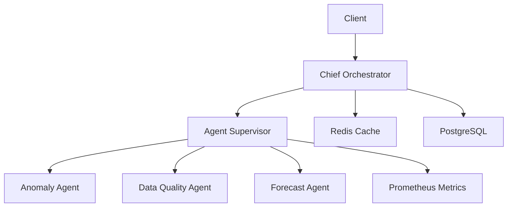
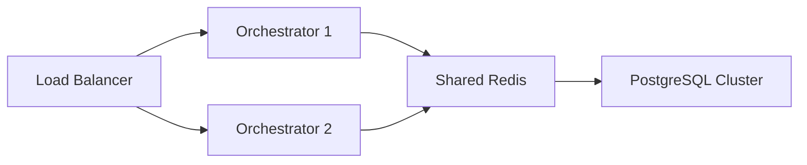

# Predator11 Architecture Overview

## System Components

## Data Flow

1. **Request Processing**:
   - Client → Chief Orchestrator → Agent Supervisor → Specialized Agents

2. **Metrics Pipeline**:
   - Agents → Prometheus → Grafana

3. **Event Stream**:
   - Agents → Redis Streams → Monitoring Tools

## Deployment Topology

## Technology Stack

| Component       | Technology          |
|----------------|--------------------|
| Orchestration | Python/AsyncIO     |
| Metrics       | Prometheus         |
| Caching       | Redis              |
| Storage       | PostgreSQL         |
| Agents        | Python Microservices |
| API           | FastAPI            |
