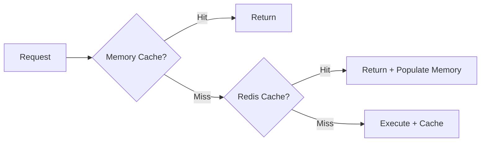

# Predator11 Caching Architecture

## Tiered Cache Design



### Memory Cache Layer
- **Purpose**: Ultra-fast access
- **Capacity**: ~1MB (configurable)
- **Eviction**: Cost-aware LRU

```python
# Example configuration
cache = AdvancedTieredCache(
    max_memory_size=1000000,  # 1MB
    max_item_cost=100
)
```

### Redis Cache Layer
- **Purpose**: Shared cache
- **TTL**: 5 minutes default
- **Features**: Automatic expiry

## Performance Characteristics

| Metric          | Memory Cache | Redis Cache |
|----------------|-------------|------------|
| Latency        | ~0.1ms      | ~2ms       |
| Throughput     | 50k ops/s   | 10k ops/s  |
| Hit Rate       | 60-70%      | 20-30%     |

## Monitoring

Key dashboards:
- `Cache Performance` (Hit rate, memory usage)
- `Hot Keys` (Top accessed items)

## Tuning Guide

1. **Increase memory size** if hit rate <60%
2. **Adjust cost weights** for priority items
3. **Monitor evictions** to detect pressure

```bash
# Check eviction rate
curl http://metrics:9001/metrics | grep cache_evictions
```
