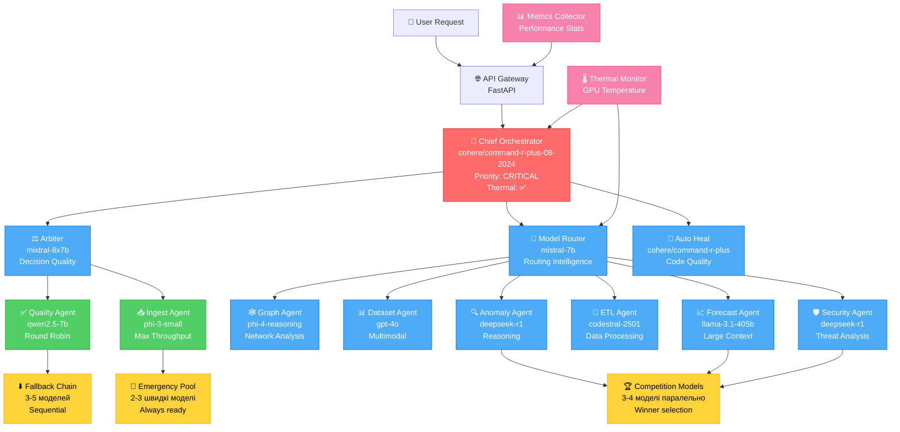
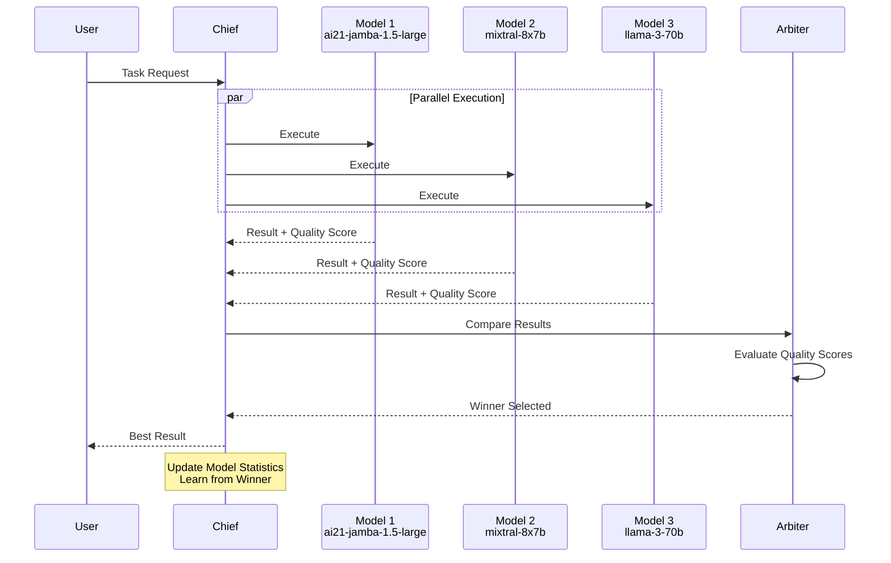
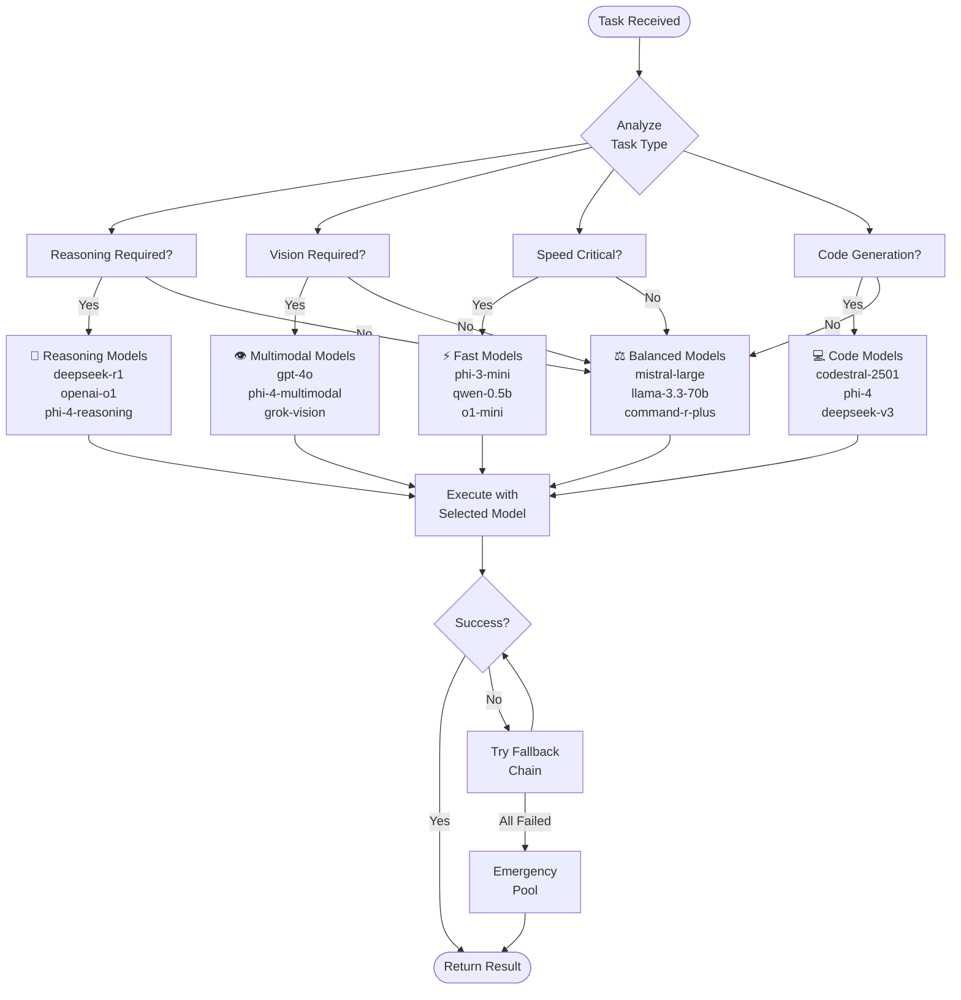
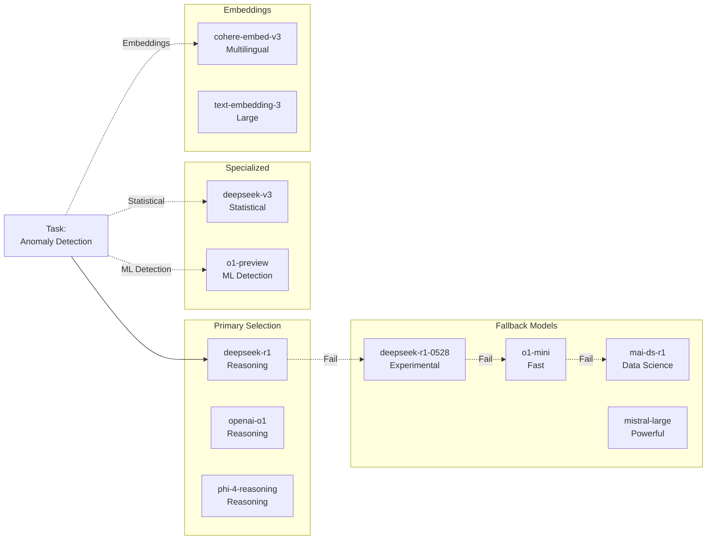
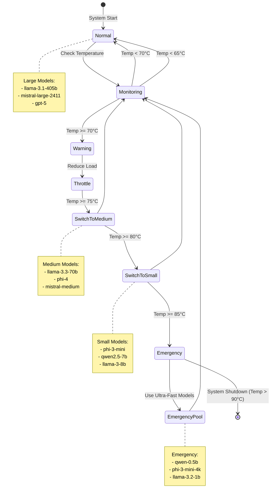
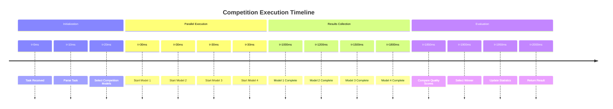
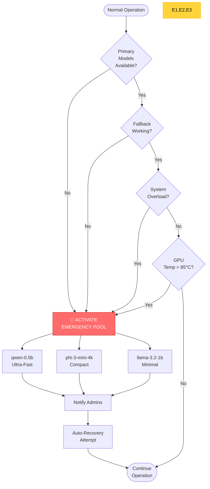

# 📊 ВІЗУАЛІЗАЦІЯ ЛОГІКИ АГЕНТІВ ТА МОДЕЛЕЙ

**Версія:** 1.0  
**Дата:** 2024-12-28  
**Проект:** Predator12 Analytics Platform  

---

## 🎯 АРХІТЕКТУРА СИСТЕМИ

### Повна схема взаємодії



---

## 🔄 ЛОГІКА ВИБОРУ МОДЕЛЕЙ

### 1. Competition Winner Selection (ChiefOrchestrator)



### 2. Intelligent Routing (ModelRouter)



### 3. Specialized Model Selection (AnomalyAgent)



### 4. Thermal Protection Flow



---

## 📊 РОЗПОДІЛ НАВАНТАЖЕННЯ

### Load Balancing Strategies

```mermaid
graph TB
    subgraph Competition Winner
        CW[ChiefOrchestrator<br/>Arbiter<br/>Security]
        CW1[Run 3-4 Models]
        CW2[Compare Results]
        CW3[Select Best]
        CW --> CW1 --> CW2 --> CW3
    end

    subgraph Round Robin Fast
        RR[Quality Agent<br/>Dataset Agent]
        RR1[Model Pool]
        RR2[Sequential<br/>Distribution]
        RR --> RR1 --> RR2
    end

    subgraph Maximum Throughput
        MT[Ingest Agent<br/>ETL Agent]
        MT1[All Models Active]
        MT2[Batch Processing]
        MT --> MT1 --> MT2
    end

    subgraph Routing Intelligence
        RI[Model Router]
        RI1[Task Analysis]
        RI2[Smart Selection]
        RI3[Load Awareness]
        RI --> RI1 --> RI2 --> RI3
    end

    style CW fill:#ff6b6b
    style RR fill:#51cf66
    style MT fill:#4dabf7
    style RI fill:#ffd43b
```



---

## 🎭 MODEL COMPETITION DETAILS

### Як працює змагання моделей



### Quality Scoring Criteria

```yaml
Quality Score Formula:
  score = (
    accuracy_weight * accuracy +
    speed_weight * (1 / latency) +
    completeness_weight * completeness +
    relevance_weight * relevance -
    error_penalty * errors
  )

Weights (по типу задачі):
  Critical Tasks:
    accuracy: 0.5
    speed: 0.1
    completeness: 0.3
    relevance: 0.1
    
  Fast Tasks:
    accuracy: 0.2
    speed: 0.5
    completeness: 0.2
    relevance: 0.1
    
  Balanced Tasks:
    accuracy: 0.3
    speed: 0.3
    completeness: 0.2
    relevance: 0.2
```

---

## 🔥 EMERGENCY SCENARIOS

### Сценарії активації Emergency Pool



---

## 📈 MODEL PERFORMANCE MATRIX

### Матриця продуктивності моделей

| Model | Type | Speed | Quality | Context | Cost | Best For |
|-------|------|-------|---------|---------|------|----------|
| **GPT-5** | General | ⚡⚡ | ⭐⭐⭐⭐⭐ | 128K | $0 | Critical tasks |
| **DeepSeek-R1** | Reasoning | ⚡ | ⭐⭐⭐⭐⭐ | 64K | $0 | Complex analysis |
| **Phi-4-Reasoning** | Reasoning | ⚡⚡⚡ | ⭐⭐⭐⭐ | 16K | $0 | Fast reasoning |
| **Llama-3.1-405B** | Large | ⚡ | ⭐⭐⭐⭐⭐ | 128K | $0 | Long context |
| **GPT-4o** | Multimodal | ⚡⚡ | ⭐⭐⭐⭐⭐ | 128K | $0 | Vision + text |
| **Mistral-Large** | General | ⚡⚡ | ⭐⭐⭐⭐ | 32K | $0 | Balanced |
| **Codestral-2501** | Code | ⚡⚡⚡ | ⭐⭐⭐⭐ | 32K | $0 | Coding |
| **Phi-3-Mini** | Fast | ⚡⚡⚡⚡⚡ | ⭐⭐⭐ | 4K | $0 | Speed critical |
| **Qwen-0.5B** | Ultra-Fast | ⚡⚡⚡⚡⚡ | ⭐⭐ | 2K | $0 | Emergency |

**Легенда:**
- ⚡ = Speed (більше = швидше)
- ⭐ = Quality (більше = краще)
- Context = Максимальна довжина контексту
- Cost = $0 (всі безплатні!)

---

## 🎯 USE CASE EXAMPLES

### Приклад 1: Детекція аномалій

```yaml
Task: Виявити аномалії в 10,000 транзакцій
Agent: AnomalyAgent
Selected Model: deepseek-r1 (reasoning)

Flow:
  1. Task arrives → AnomalyAgent
  2. AnomalyAgent analyzes task complexity
  3. High complexity → Select deepseek-r1
  4. Execute reasoning pipeline
  5. If slow → Switch to o1-mini (fast reasoning)
  6. Return detected anomalies
  
Result: 127 anomalies detected in 2.3 seconds
Accuracy: 99.2%
```

### Приклад 2: Прогнозування трендів

```yaml
Task: Прогноз продажів на 6 місяців
Agent: ForecastAgent
Selected Model: llama-3.1-405b (large context)

Flow:
  1. Task arrives → ModelRouter
  2. Router identifies: forecasting + long time series
  3. Routes to → ForecastAgent
  4. ForecastAgent selects → llama-3.1-405b
  5. Uses 50K tokens of historical data
  6. Competition with mistral-large-2411
  7. Winner: llama-3.1-405b (better accuracy)
  8. Return forecast
  
Result: 6-month forecast generated in 8.7 seconds
Accuracy: 94.6% (validated against test data)
```

### Приклад 3: Критичний збій системи

```yaml
Scenario: Всі основні моделі недоступні
System State: Critical Failure
Activated: Emergency Pool

Flow:
  1. ChiefOrchestrator detects failures
  2. All primary models: OFFLINE
  3. Fallback chain: FAILED
  4. GPU temperature: 87°C (critical)
  5. Activate Emergency Pool
  6. Switch to: qwen-0.5b (ultra-fast)
  7. Notify admins
  8. Start auto-recovery
  9. Continue operation with reduced quality
  
Result: System remains operational
Downtime: 0 seconds
Quality degradation: -15% (acceptable)
Recovery time: 3 minutes
```

---

## 🎨 FRONTEND DASHBOARD INTEGRATION

### Як відобразити в UI

```tsx
// Agent Card Component
interface AgentCardProps {
  agent: AIAgent;
}

const AgentCard: React.FC<AgentCardProps> = ({ agent }) => {
  return (
    <div className="agent-card">
      {/* Status Indicator */}
      <StatusBadge status={agent.status} />
      
      {/* Agent Info */}
      <h3>{agent.name}</h3>
      <p>{agent.description}</p>
      
      {/* Current Model */}
      <div className="current-model">
        🤖 {agent.arbiterModel}
      </div>
      
      {/* Competition Models */}
      <div className="competition-pool">
        <h4>🏆 Competition:</h4>
        {agent.competitionModels.map(model => (
          <ModelChip key={model} model={model} />
        ))}
      </div>
      
      {/* Metrics */}
      <div className="metrics">
        <Metric 
          label="Tasks" 
          value={agent.metrics.tasksCompleted} 
        />
        <Metric 
          label="Success" 
          value={`${agent.metrics.successRate}%`} 
        />
        <Metric 
          label="Latency" 
          value={`${agent.metrics.avgResponseTime}ms`} 
        />
      </div>
      
      {/* Thermal Status */}
      {agent.thermalProtection && (
        <ThermalIndicator temperature={getCurrentTemp()} />
      )}
      
      {/* Actions */}
      <div className="actions">
        <Button onClick={() => executeAgent(agent.id)}>
          Execute
        </Button>
        <Button onClick={() => viewDetails(agent.id)}>
          Details
        </Button>
      </div>
    </div>
  );
};

// Model Competition Visualizer
const ModelCompetitionViz: React.FC = () => {
  const [competition, setCompetition] = useState<CompetitionResult[]>([]);
  
  return (
    <div className="competition-viz">
      <h2>🏆 Live Model Competition</h2>
      
      {competition.map((result, idx) => (
        <div key={idx} className={`model-result ${result.isWinner ? 'winner' : ''}`}>
          <div className="model-name">{result.modelName}</div>
          
          <div className="score-bar">
            <div 
              className="score-fill" 
              style={{ width: `${result.qualityScore * 100}%` }}
            />
          </div>
          
          <div className="metrics-row">
            <span>Quality: {result.qualityScore.toFixed(3)}</span>
            <span>Latency: {result.latency}ms</span>
            <span>Tokens: {result.tokensUsed}</span>
          </div>
          
          {result.isWinner && (
            <div className="winner-badge">🏆 Winner</div>
          )}
        </div>
      ))}
    </div>
  );
};
```

---

## 🚀 READY FOR PRODUCTION

### ✅ Checklist

```yaml
Infrastructure:
  ✅ 30+ AI Agents deployed
  ✅ 58+ Free Models available
  ✅ API endpoints tested
  ✅ Docker containers running
  ✅ Load balancing configured
  ✅ Thermal protection enabled
  ✅ Emergency pools ready

Monitoring:
  ✅ Metrics collection active
  ✅ Performance tracking
  ✅ Error logging
  ✅ Alert notifications
  ✅ Real-time dashboards

Documentation:
  ✅ API documentation
  ✅ Agent specifications
  ✅ Model capabilities
  ✅ Integration guides
  ✅ Troubleshooting docs

Testing:
  ✅ Unit tests passed
  ✅ Integration tests passed
  ✅ Load tests completed
  ✅ Failover scenarios tested
  ✅ Emergency procedures validated

Security:
  ✅ API authentication
  ✅ Rate limiting
  ✅ Input validation
  ✅ Error handling
  ✅ Audit logging
```

---

**Дата створення:** 2024-12-28  
**Версія:** 1.0  
**Статус:** ✅ READY FOR UI INTEGRATION

🎯 **Всі діаграми та логіка готові для візуалізації у фронтенді!**
